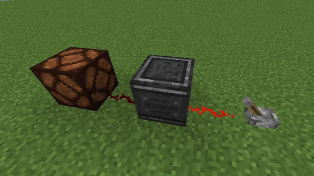
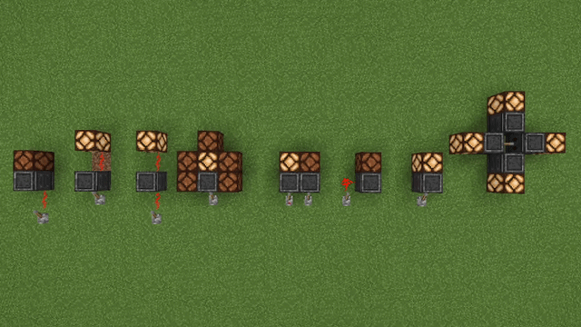
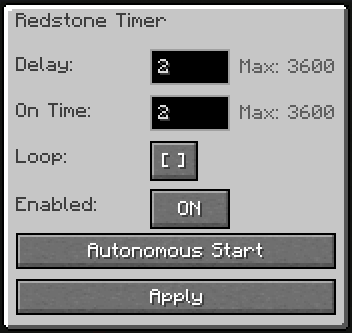
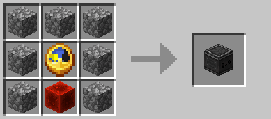

# Redstone Timer


Redstone Timer is a Minecraft Fabric mod that adds a configurable redstone timer block.

It allows you to delay a redstone output, control how long the output stays on, and configure behavior through an in-game GUI.

## Download

<p>
  <a href="https://modrinth.com/mod/redstone-timer-thbtt">
    
  </a>
  <a href="https://modrinth.com/mod/redstone-timer-thbtt">Download on Modrinth</a>
</p>

## Demonstration



## Features

- Configurable delay time
- Configurable on-time duration
- Loop mode
- Enable/disable toggle
- Autonomous Start mode
- Directional redstone output
- Optional ticking sound
- Mod Menu integration
- English and Brazilian Portuguese translations
- JEI-compatible through vanilla crafting recipes

## How to use

Place the Redstone Timer block and right-click it to open the configuration screen.

The block receives redstone input from the front and outputs redstone from the back.



### GUI options



- **Delay**: how many seconds the timer waits before activating.
- **On Time**: how many seconds the output stays active.
- **Loop**: repeats the timer while input is active.
- **Enabled**: enables or disables the timer.
- **Autonomous Start**: starts the timer once after applying the settings.

## Crafting Recipe



```txt
Cobblestone | Cobblestone    | Cobblestone
Cobblestone | Clock          | Cobblestone
Cobblestone | Redstone Block | Cobblestone
```

## Requirements

- Minecraft 1.21.1
- Fabric Loader
- Fabric API

## Recommended Mods

These mods are not required, but they are recommended when using Redstone Timer:

- [Mod Menu](https://modrinth.com/mod/modmenu) - Lets you enable or disable the Redstone Timer sound in-game.
- [Just Enough Items (JEI)](https://modrinth.com/mod/jei) - Lets you view the Redstone Timer crafting recipe in-game.

## Installation

1. Install Fabric Loader for Minecraft 1.21.1.
2. Install Fabric API.
3. Download the Redstone Timer `.jar` file from Modrinth.
4. Place the `.jar` file in your Minecraft `mods` folder.
5. Launch Minecraft using the Fabric profile.

## Development

To build the project, run:

```bash
./gradlew build
```

On Windows:

```powershell
.\gradlew build
```

The compiled mod file will be generated in:

```txt
build/libs
```

## Languages

Redstone Timer includes translations for:

- English
- Brazilian Portuguese

## Status

Redstone Timer is currently available for Minecraft 1.21.1 Fabric.

Future updates may add improvements and new configuration options.

## Author

Created by ThBTT.

## Contact

For questions, suggestions, or bug reports, join the Discord server:

https://discord.gg/pcKQSDgTzh

## License

This project is licensed under the MIT License.